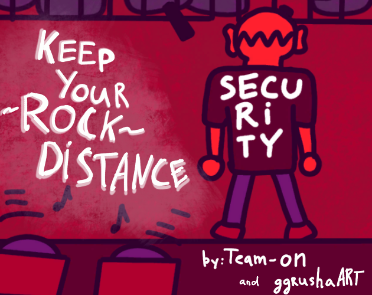
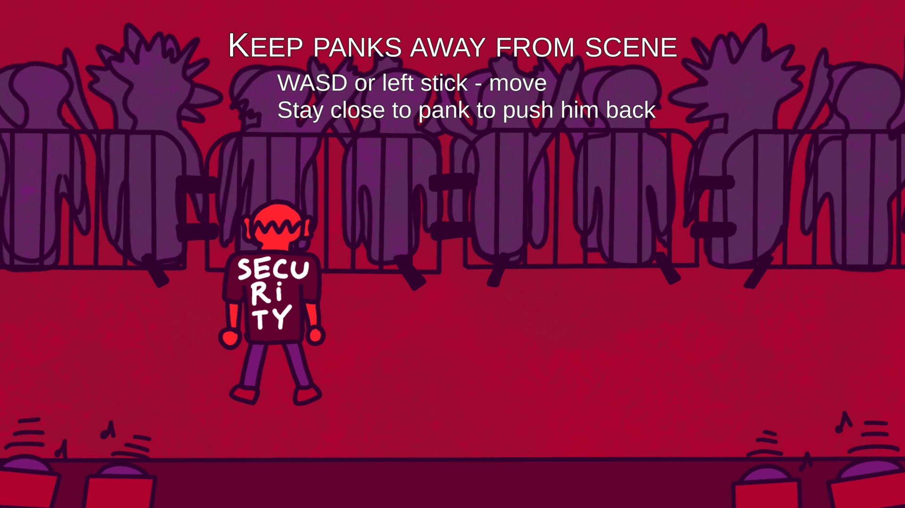
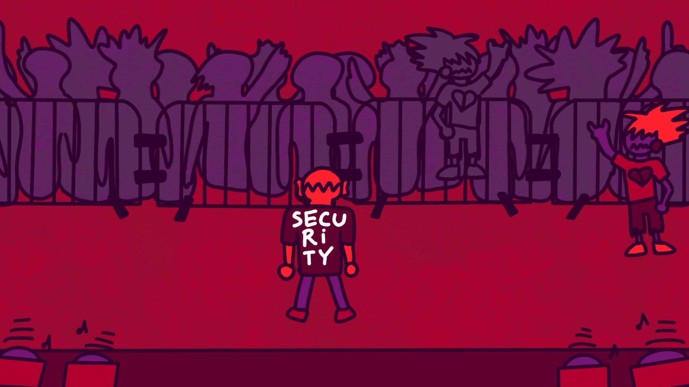

# [Keep your rock distance](https://teamon.itch.io/keep-your-rock-distance)
[TriJam #68: The 3 hour game jam](https://itch.io/jam/trijam-68)  
Theme: Keep Your Distance

Protect scene from panks!

# Downloads and Links
Available in [Windows, OSX, Linux and Web](https://teamon.itch.io/keep-your-rock-distance). If you encounter any problem, please leave a issue! 

#  How to play
 * A/D or arrows - move

# What is TriJam?
TriJam is a jam where your goal is to try and make something playable (and fun) in only 3 hours! How is that even possible, you ask? Well, just look at the history of previous TriJams and we're sure you'll be convinced that it is not only possible, but very manageable!

# Used assets:
 * https://opengameart.org/content/alt-rock-song - main music

# Screenshots
  
  
